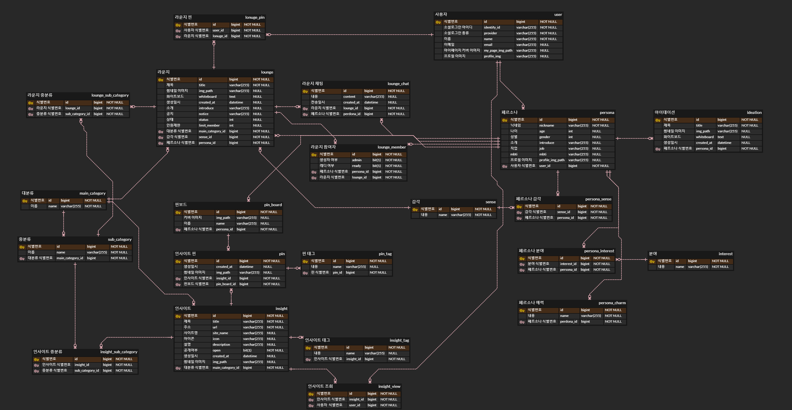

# ation

경희대학교 컴퓨터공학과X산업디자인학과 연합 웹 개발 프로젝트

### 창작가들을 위한 아이데이션 서비스, 에이션

## backend 기술스택

## ERD

    

## Swagger

http://ation-server.seohyuni.com/swagger-ui.html

## 주요 기능

✔**Login**: 구글, 카카오 소셜로그인 연동

✔**Persona**: 서비스에서 활동할 캐릭터, 페르소나

- 유저의 감각을 기반으로 총 3개의 페르소나를 관리
- 자유로운 신분 아래 소통하고자 하는 니즈와 ‘멀티 페르소나’ 라는 사회적 트렌드 분석 하에 만들어진 기능

    

✔**Insight & Pin** : 서로의 인사이트를 공유 및 보관

- 페르소나별 관심분야 파악을 통한 인사이트 추천
- url을 통해 페이지명, 썸네일, 사이트명, 로고 등 html 파싱
- 보관하고 싶은 인사이트는 페르소나별 핀보드에 핀업

    

✔**Ideation** : 나만의 아이데이션 페이지

- 언제 떠오를지 모르는 아이디어를 기록할 수 있는 화이트보드 공간

    

✔**Lonuge** : 아이디어에 대해 이야기하고 싶은 사람들을 위한 대화공간

- 대기실 : 신뢰감을 쌓고, 관심 분야를 공유할 수 있는 공간
- 라운지 : 본격적으로 아이디어를 공유하고 제대로 이야기하고싶은 사람들을 위한 Next step. 화이트 보드 기능을 바탕으로 아이디어를 구체적으로 그려볼 수 있는 공간

